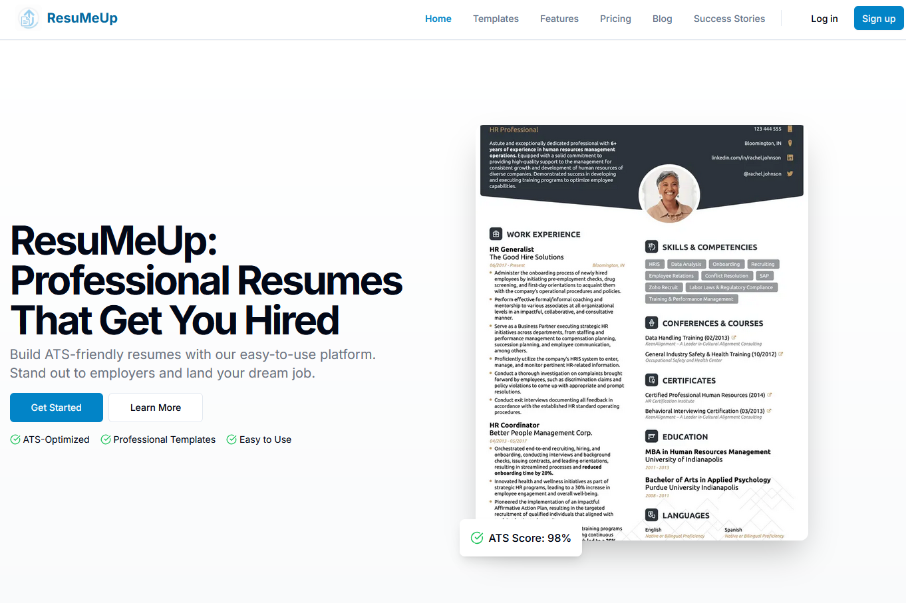

# ResuMeUp - Professional Resume Builder

ResuMeUp is a modern, responsive web application built with Next.js that helps users create professional, ATS-friendly resumes. The platform features a sleek UI/UX,a variety of resume templates designed to help you land your dream job.

## Preview



*Above: A preview of the ResuMeUp homepage.*

## Table of Contents

- [Features](#features)
- [Prerequisites](#prerequisites)
- [Getting Started](#getting-started)
  - [Installation](#installation)
  - [Environment Variables](#environment-variables)
  - [Running the Development Server](#running-the-development-server)
  - [Building for Production](#building-for-production)
- [Project Structure](#project-structure)
- [Technologies Used](#technologies-used)
- [Troubleshooting](#troubleshooting)
- [Contributing](#contributing)
- [License](#license)

## Features

- **Responsive Design**: Mobile-first, fully responsive layout
- **Authentication System**: Email/password and Google social login via Supabase
- **Resume Templates**: Multiple professional, ATS-optimized templates
- **ATS Optimization**: Templates designed to pass Applicant Tracking Systems
- **Accessibility**: WCAG-compliant components and semantic HTML
- **SEO Friendly**: Optimized metadata and semantic structure
- **User Dashboard**: Manage, edit, and download resumes
- **Success Stories**: Real user testimonials and stories

## Prerequisites

Before you begin, ensure you have the following installed:

- [Node.js](https://nodejs.org/) (v18.17.0 or later)
- [npm](https://www.npmjs.com/) (v9.6.7 or later) or [yarn](https://yarnpkg.com/) or [pnpm](https://pnpm.io/)
- [Git](https://git-scm.com/)

## Getting Started

### Installation

1. Clone the repository:

```bash
git clone https://github.com/ichikapaull/ResuMeUp.git
cd resumeup

```

2. Install dependencies:

```bash
npm install
# or
yarn install
# or
pnpm install
```

### Environment Variables

Create a `.env.local` file in the root directory and add your Supabase credentials:

```env
NEXT_PUBLIC_SUPABASE_URL=your-supabase-url
NEXT_PUBLIC_SUPABASE_ANON_KEY=your-supabase-anon-key
```

### Running the Development Server

```bash
npm run dev
```

Visit [http://localhost:3000](http://localhost:3000) to view the app.

### Building for Production

```bash
npm run build
npm start
```

## Project Structure

```
app/                # Next.js app directory (pages, layouts, etc.)
components/         # Reusable React components
lib/                # Utility libraries (Supabase client, helpers, etc.)
public/             # Static assets (images, favicon, etc.)
docs/               # Documentation assets (screenshots, etc.)
```

## Technologies Used

- [Next.js](https://nextjs.org/)
- [React](https://react.dev/)
- [Supabase](https://supabase.com/) (Auth & DB)
- [Tailwind CSS](https://tailwindcss.com/)
- [Zod](https://zod.dev/) (Validation)
- [React Hook Form](https://react-hook-form.com/)
- [Radix UI](https://www.radix-ui.com/)

## Troubleshooting

- Ensure your environment variables are set correctly for Supabase.
- If you encounter hydration errors, make sure all browser-specific logic is inside `useEffect`.
- For authentication issues, check your Supabase project settings and redirect URLs.

## Contributing

Pull requests are welcome! For major changes, please open an issue first to discuss what you would like to change.

## License

[MIT](LICENSE)
